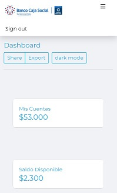

# [BCS UI](https://bcs.com/demo)

[BCS](https://bcs.com/demo) is a free Admin, new design inspired by Bootstrap 5.1

Created with the [bootstrap 5.1](https://getbootstrap.com) core so it will allow you to use these components without any
inconvenience

## Info

- The repository includes CSS3, HTML5, SASS, typescript and JS files.

## Demo

- see [Demo](https://corpjorge.com/demo)

## Quick start

- `npm i corpjorge-bcs-sass`
- `yarn add corpjorge-bcs-sass`
- Clone the repo: `git clone https://github.com/corpjorge/corpjorge-bcs-sass.git`.
- [Download from Github](https://github.com/corpjorge/bcs-sass/archive/master.zip).
- [Download from Site](https://bcs-sass.corpjorge.com).

## Dark Mode

- Activate Dark Mode
  

## Responsive design

## Licensing

- Licensed under MIT (https://github.com/corpjorge/bcs-sass/blob/master/LICENSE)
